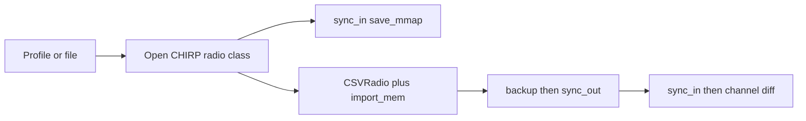

# Multi-radio CHIRP CLI

Build `chirpctl` in this empty repo. It imports the official [kk7ds/chirp](https://github.com/kk7ds/chirp) library (`directory`, `sync_in` / `sync_out`, `CSVRadio`, `import_logic`) and exposes a subcommand CLI. Upstream `chirpc` stays untouched: it is one radio, flag-soup, in-place image edits, and no CSV or cross-radio copy. Stock `chirpc` download/upload is only:

```text
chirpc -r Baofeng_UV-32 --serial=/dev/cu.usbserial-A50285BI --mmap=radio.img --download-mmap
chirpc -r Baofeng_UV-32 --serial=/dev/cu.usbserial-A50285BI --mmap=radio.img --upload-mmap
```

The same path the GUI used for the UV-32 (FTDI `cu.usbserial-A50285BI`, model `Baofeng_UV-32`) becomes a few commands. A second recent model, Baofeng 5RM, is just another profile.

License is GPL-3, matching CHIRP. Drivers are a pip dependency from git, not copied into this repo. No wxPython. Venv on the installed Python 3.12 (`chirp` wants `>=3.10,<4`).

## Command surface

Targets are a profile name, `Model@port`, or a `.img` / `.csv` file.

- `radios list|search` — `directory.DRV_TO_RADIO` after `directory.import_drivers()`
- `ports` — macOS `cu.usbserial*` / `cu.usbmodem*`
- `profile add|list|remove` — `~/.config/chirpctl/radios.toml` (`model`, `port`, optional `baud`)
- `read <target> [-o file.img]` — `sync_in` + `save_mmap`, also copy into `~/.chirp/backups/`
- `write <target> <image-or-csv>` — backup download first, then `load_mmap` or CSV import, then `sync_out`. Refuses if the image model does not match the target. Requires `--yes`
- `copy <src> <dst>` — radio, image, or CSV to radio, image, or CSV. Channel copy goes through `import_logic.import_mem` so a UV-32 plan can land on a different model the same way the GUI paste does. `--replace` empties destination channels the source does not fill
- `channels list|get|set|clear|import|export` — memories via `get_memory` / `set_memory`. Import uses `generic_csv.CSVRadio` plus `import_logic.import_mem`. `--clear-rest` blanks channels outside the file (the 28-to-41 UV-32 case)
- `settings list|get|set` — walk `radio.get_settings()`
- `diff <a> <b>` — channel-by-channel, exit 1 on mismatch
- `verify <target> <csv-or-img>` — write, read back, diff. This is the upload-then-second-download check from the UV-32 session
- `fleet read|write` — every profile, one radio at a time (clone drivers are not safe to run in parallel). Skip a profile whose port is absent and keep going

Example for the radio already programmed today:

```text
chirpctl profile add uv32 --model Baofeng_UV-32 --port /dev/cu.usbserial-A50285BI
chirpctl read uv32
chirpctl channels import uv32 Tech_channels_repeaters_noaa.chirp.csv --clear-rest -o plan.img
chirpctl write uv32 plan.img --yes
chirpctl verify uv32 plan.img
chirpctl copy uv32 5rm --replace --yes
```

`detect` will not be promised for Baofeng clone radios. CHIRP only auto-IDs some Icom radios (`chirp.detect`); everyone else must name the model, which profiles store.

Every command accepts `--format text|json`. JSON is one object on stdout (`ok`, `command`, `radios` or `channels` or `diff`) so an agent can parse a read or a mismatch without scraping a table. Exit 0 on success, 1 on a channel mismatch or a refused write, 2 on usage or a missing radio. Progress stays on stderr.

## Agent skill

The CLI is the tool. The skill is how Grok, Claude Code, Cursor, and Codex know to call it instead of the CHIRP window or `chirpc`.

Canonical copy lives in the repo at [skills/chirpctl/SKILL.md](skills/chirpctl/SKILL.md), with a short [skills/chirpctl/reference.md](skills/chirpctl/reference.md) for the command list. Frontmatter `name` and `description` follow the shared skill format those CLIs already load (same shape as `~/.grok/skills/` and `~/.claude/skills/`). The description names the triggers: CHIRP, radio programming, Baofeng, UV-32, memories, channels, `.img`, clone, upload, download. Auto-invoke stays on so a radio request pulls the skill in without a slash command.

Install links that one directory into the skill roots already on this machine:

- `~/.grok/skills/chirpctl`
- `~/.claude/skills/chirpctl`
- `~/.cursor/skills/chirpctl`
- `~/.codex/skills/chirpctl`
- `~/.agents/skills/chirpctl`

A `chirpctl skill install` command refreshes those links after the package is on `PATH`.

The skill tells the agent:

- Shell out to `chirpctl`. Do not drive the GUI and do not shell out to `chirpc`.
- Start with `ports`, `profile list`, and `radios search` when the model or cable is unknown.
- Read, list, export, diff, and image edits are fine to run.
- `write`, `verify`, `copy` onto a live radio, `fleet write`, and any command with `--yes` wait for an explicit yes in the conversation for that radio and that file. The skill shows the exact command first.
- One radio at a time. Fleet is sequential.
- Prefer `--format json`.
- Treat a verify diff as the done check, the same way the UV-32 upload was confirmed by a second download.

## How a transfer works




Power levels, TX inhibit, and name-length limits stay inside the driver. Five watts on the UV-32 still becomes that radio’s Medium level because `import_mem` does the conversion. Comments that the radio cannot store are reported as dropped, not silently treated as programmed.

`csv normalize` is a separate preprocessor for the Numbers export bugs from that session: rows with an empty tone shifted one column left, and names stored as currency (`-1`, `-2`). Normal import expects a real CHIRP CSV like [Tech_channels_repeaters_noaa.chirp.csv](/Users/mac/Desktop/baba-yaga-drone-specs/archipelago/Workbooks/Tech_channels_repeaters_noaa.chirp.csv).

## Layout

- [pyproject.toml](pyproject.toml) — package `chirpctl`, console script `chirpctl`, dependency `chirp @ git+https://github.com/kk7ds/chirp.git`
- [src/chirpctl/cli.py](src/chirpctl/cli.py) — argparse subcommands
- [src/chirpctl/session.py](src/chirpctl/session.py) — open a live port or image, status callback for clone progress
- [src/chirpctl/profiles.py](src/chirpctl/profiles.py) — TOML profiles
- [src/chirpctl/transfer.py](src/chirpctl/transfer.py) — read, write, backup, model check
- [src/chirpctl/memories.py](src/chirpctl/memories.py) — list, edit, CSV import/export, cross-radio copy
- [src/chirpctl/diff.py](src/chirpctl/diff.py) — memory equality on the CSV fields CHIRP actually stores
- [src/chirpctl/fleet.py](src/chirpctl/fleet.py) — sequential multi-radio runs
- [src/chirpctl/output.py](src/chirpctl/output.py) — text and JSON formatters, shared exit codes
- [skills/chirpctl/SKILL.md](skills/chirpctl/SKILL.md) — agent instructions for Grok, Claude, Cursor, and Codex
- [tests/](tests/) — offline only, against copies of `~/.chirp/backups/Baofeng_UV-32_download_20261002T142817.img` and the workbook CSV. No upload during implementation

## Safety while building

Implementation tests open the saved UV-32 image and the CSV. They do not call `sync_out`. A live `read` is only run if that cable is present and you ask for it. `write` and `verify` always download a backup first and require `--yes`.