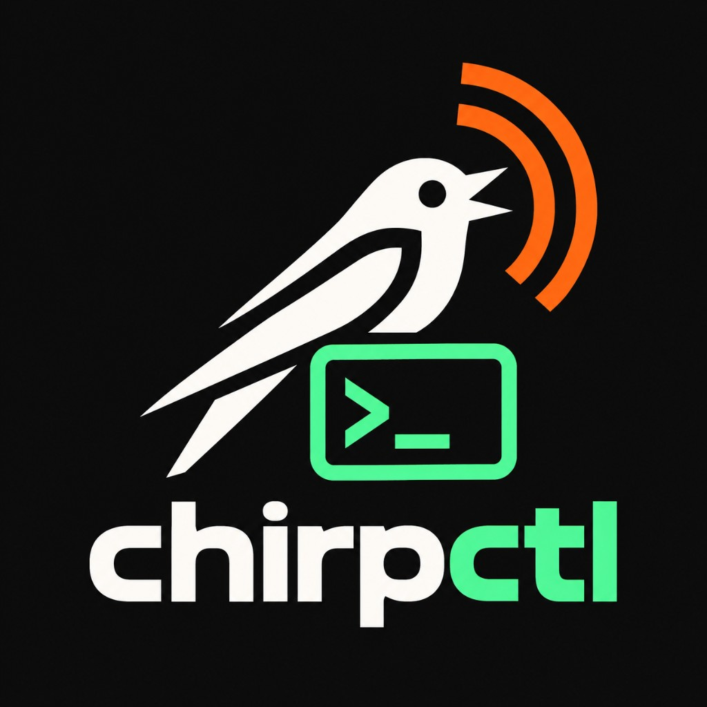

<p align="center">
  
</p>

# chirpctl

**Multi-radio CHIRP programming from the terminal** — built on the official [CHIRP](https://github.com/kk7ds/chirp) drivers. Name your radios once, import CSV channel plans, backup, upload, and verify read-back without the GUI.

For humans who want a fast, repeatable workflow. For agents who need stable CLI + JSON + a bundled skill.

[](https://github.com/mrdulasolutions/CHIRP-CLI-TOOL/actions/workflows/ci.yml)
[](LICENSE)

## Why chirpctl?

| CHIRP GUI | `chirpc` | **chirpctl** |
|-----------|----------|--------------|
| Click-through clone/import | Low-level flags, one radio | Named profiles, groups, fleet |
| Hard to automate | No CSV workflow / verify | `program` = backup → import → upload → verify |
| — | — | Agent skill + `--format json` |

## Requirements

- Python **3.10–3.12** (3.12 recommended)
- macOS or Linux (serial programming cable; FTDI/USB common on Baofeng)
- Radios supported by [CHIRP](https://chirp.danplanet.com/projects/chirp/wiki/Home)

Baofeng clones (e.g. **UV-32**) are **not** auto-identified on the wire — you set the model in a profile (same as CHIRP).

## Install

```bash
git clone https://github.com/mrdulasolutions/CHIRP-CLI-TOOL.git
cd CHIRP-CLI-TOOL
./scripts/install.sh
```

Or manually:

```bash
python3.12 -m venv .venv
source .venv/bin/activate
pip install -e ".[dev]"
chirpctl skill install   # Grok, Claude, Cursor, Codex, ~/.agents
```

## Quick start

```bash
# Import model + port from ~/.chirp/chirp.config if you use CHIRP GUI
chirpctl setup --profile uv32

chirpctl status
chirpctl program uv32 Tech_channels.chirp.csv --dry-run
chirpctl program uv32 Tech_channels.chirp.csv --yes
```

Undo a bad upload:

```bash
chirpctl backups
chirpctl restore uv32 --pick 1 --yes
```

## Common commands

```bash
chirpctl ports                          # serial devices
chirpctl detect /dev/cu.usbserial-…   # detect or CHIRP GUI hint
chirpctl profile add NAME --model Baofeng_UV-32 --port PORT
chirpctl group set field uv32 ht2       # program a group: chirpctl program field plan.csv --yes
chirpctl fleet program plan.csv --yes   # all profiles (skip missing ports)
chirpctl channels validate plan.csv --model Baofeng_UV-32
chirpctl diff plan.img radio.img --explain
chirpctl wizard                         # interactive setup
```

Full reference: [skills/chirpctl/reference.md](skills/chirpctl/reference.md)

## Safety

- **Read / list / diff / dry-run** — safe without extra flags.
- **`write`, `program`, `verify`, `restore`, `copy` to live radio** — require `--yes`.
- Every upload downloads a **pre-upload backup** under `~/.chirp/backups/`.

Exit codes: `0` success, `1` verify/diff mismatch, `2` error or refused.

## For AI agents

1. Install the repo and run `chirpctl skill install`.
2. Skill source: [skills/chirpctl/SKILL.md](skills/chirpctl/SKILL.md)
3. Prefer `--format json`; schema notes in [skills/chirpctl/json-schema.md](skills/chirpctl/json-schema.md)
4. Repo agent guide: [AGENTS.md](AGENTS.md)

Do **not** drive the CHIRP GUI or raw `chirpc` when `chirpctl` is available.

## Config locations

| Path | Purpose |
|------|---------|
| `~/.config/chirpctl/radios.toml` | Named profiles |
| `~/.config/chirpctl/groups.toml` | Profile groups |
| `~/.config/chirpctl/snapshots/` | Named plan images |
| `~/.chirp/backups/` | Clone backups (shared with CHIRP) |

## Development

```bash
pip install -e ".[dev]"
pytest
```

See [CONTRIBUTING.md](CONTRIBUTING.md) and [ROADMAP.md](ROADMAP.md).

## License

GPL-3.0-or-later — same family as CHIRP. See [LICENSE](LICENSE).
